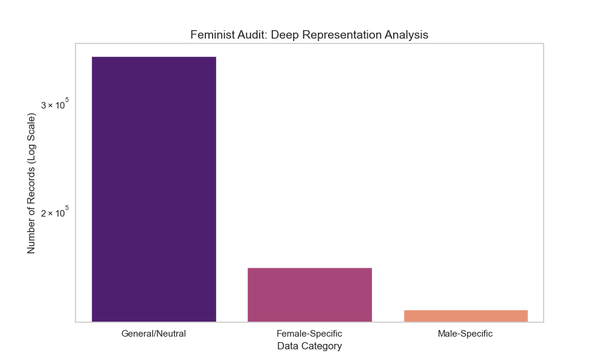

# ⚖️ Automated Fairness Audit Pipeline
**Author:** Fazeela Saleem | Data Science Student
**Theme:** Algorithmic Accountability and Gender Data Invisibility

## 🌟 Overview
This project is an **Automated Fairness Audit Tool** designed to detect gender representation bias in large-scale statistical datasets. Developed as part of my research into the "design-reality gap," this tool identifies how gender-specific indicators are often overshadowed by general data.

## 🛠️ Technical Implementation
- **Deep Pattern Recognition:** Uses Regex (Regular Expressions) to identify hidden gender indicators like `.FE.` (Female) and `.MA.` (Male) within technical SeriesCodes.
- **Audit Scale:** Successfully processed over **657,347 records** from the World Bank Gender Stats dataset.
- **Logarithmic Visualization:** Implemented a log-scale Seaborn bar chart to ensure marginalized data points (Female/Male) are clearly visible alongside massive "General" data categories.

## 📁 Project Structure
- `src/audit.py`: The core auditing engine using Regex and Log-scaling.
- `data/Gender_StatsEXCEL.xlsx`: The primary dataset.
- `deep_audit_report.png`: The visual output of the deep audit.
- `requirements.txt`: Project dependencies.
- ## 📊 Visualized Findings


## 🚀 How to Run
1. Install dependencies:
   ```bash
   pip install pandas seaborn openpyxl matplotlib
